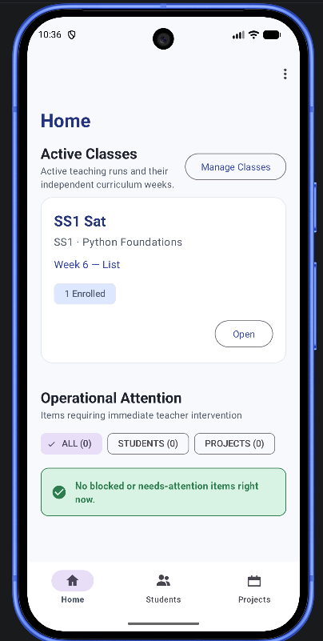
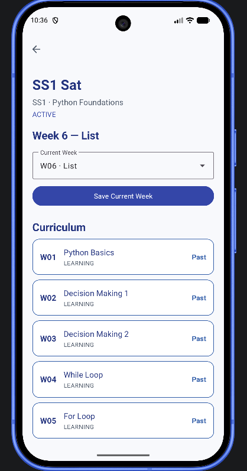
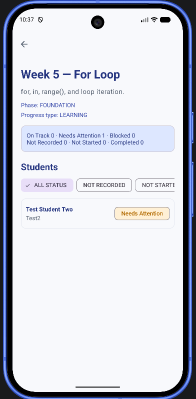
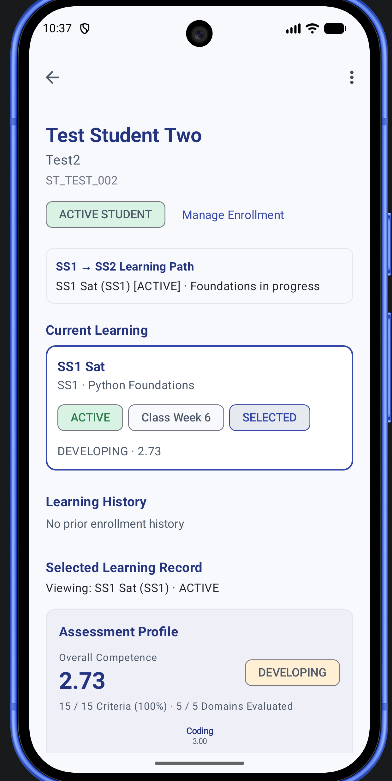
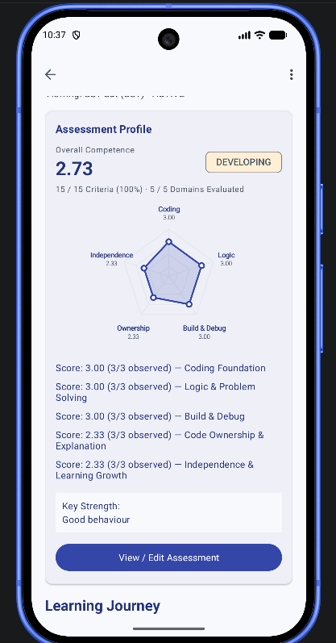
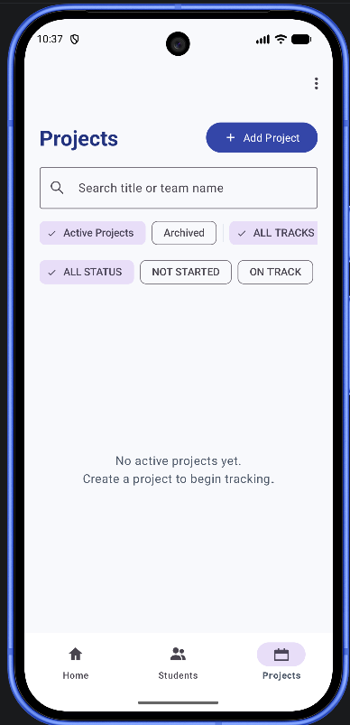

# ClassFlow

> **Teaching Operations Tool for VU Tech Academy**

ClassFlow is a native Android application designed specifically for educators and studio instructors at VU Tech Academy. It streamlines the day-to-day operational tracking of student learning journeys, weekly milestone checkpoints, rubric-based competency assessments, and collaborative studio projects across technical curriculum tracks.

---

## 1. Overview

Teaching technical studio tracks requires continuous, high-touch visibility into individual progress and team deliverables. Traditional learning management systems (LMS) excel at passive content hosting and quiz grading, but fail to address active studio pedagogy where instructors need to identify struggling students quickly, balance team interventions, and record multi-dimensional skill rubrics week over week.

ClassFlow provides an operational workbench that puts instructional health front and center:
- **Fast Status Checkpoints**: Weekly student progress tracking across dynamic track criteria.
- **Intervention Triage**: A dedicated Operational Dashboard highlighting students and teams with active blockers or needing attention.
- **Holistic Competency Assessment**: Comprehensive 15-criteria rubric evaluations embedded directly within student course enrollments.
- **Studio Project Coordination**: Team-level deliverable tracking that atomically reflects current milestone health.

---

## 2. Problem

Studio-based technology education poses unique operational challenges:
1. **Disconnected Student Journeys**: Students enroll across multiple sequential terms and distinct tracks; simple per-class rosters lose historical learning context.
2. **Delayed Intervention**: Without immediate operational visibility into student blockers, critical weeks pass before disengagement or technical impasses are caught.
3. **Inconsistent Rubric Evaluation**: Assessing engineering competencies (e.g., algorithmic logic, code structure, collaboration) often degrades into ad-hoc grading sheets.
4. **Team vs. Individual Progress Divergence**: In late-semester studio projects, individual student checkpointing must transition seamlessly into team deliverable tracking without corrupting student records.

---

## 3. Core Features

### 📋 Curriculum Tracks & Course Offerings
- Standardized 10-week curriculum blueprints:
  - **SS1 — Python Foundations** (Weeks 1–8: Foundation/Learning, Week 9: Capstone/Project, Week 10: Demo Day).
  - **SS2 — Smart Systems** (Weeks 1–4: Data & Decision, Week 5: Connected Device, Weeks 6–8: App & Cloud, Week 9: Smart System Integration, Week 10: Demo Day).
- Manage operational class cohorts (`PLANNED`, `ACTIVE`, `COMPLETED`, `ARCHIVED`) with independent `currentWeek` pacing pointers.

### 👥 Student Profiles & Multi-Enrollment Learning Paths
- Decouple permanent student identity from transient course enrollments.
- View multi-enrollment timelines with contextual weekly progress and historical assessments.

### ⏱️ Weekly Student Progress
- Log weekly individual progress checkpoints (`ON_TRACK`, `NEEDS_ATTENTION`, `BLOCKED`, `COMPLETED`).
- Enforce mandatory blocker notes when a student is impeded.
- Record dynamic rubric metrics customized per track/week.

### 🎯 SS1 Competency Assessment
- Conduct structured evaluations across 5 foundational engineering domains:
  1. Coding Foundation
  2. Logic & Problem Solving
  3. Build & Debug
  4. Code Ownership & Explanation
  5. Independence & Learning Growth
- Dynamic runtime competence score calculation with qualitative narrative feedback (strengths and priority next steps).

### 🚀 Projects & Team Progress
- Create class-linked project teams from eligible enrolled students.
- Track weekly project progress with current-week summary synchronization.

### 🚨 Operational Dashboard (Intervention Center)
- Priority intervention feed surfacing any `BLOCKED` or `NEEDS_ATTENTION` student or project across active cohorts.
- High-level class health cards enabling immediate deep-dives into at-risk cohorts.

---

## 4. Architecture

ClassFlow follows a layered, lifecycle-aware architecture designed for transaction-safe mobile operations:

```text
[ Presentation Layer ]
  Activities (ProtectedActivity) ──► Fragments ──► Adapters / Dialogs
                                      │
[ Domain / View Layer ]               ▼
  View Models / Aggregators ◄── Intent / Extra Payloads
                                      │
[ Data / Repository Layer ]          ▼
  Repositories (ClassRepository, StudentRepository, EnrollmentRepository, etc.)
                                      │
[ Backend Services ]                  ▼
  Firebase Authentication (Email/Password) & Cloud Firestore
```

Protected activities inherit from `ProtectedActivity`, which checks the Firebase Auth session in `onStart` and redirects unauthenticated sessions to `LoginActivity` while clearing the task. Detail views implement sequence token guards to prevent stale asynchronous callbacks from corrupting UI state during rapid navigation.

---

## 5. Domain Model

The relationship between core entities reflects studio operations:

```text
TRACK (Curriculum Template, 10 Weeks)
  └── CLASS (Cohort Instance)
        ├── ENROLLMENT (Active / Completed / Withdrawn / Archived)
        │     ├── STUDENT PROGRESS (Weekly Individual Mastery)
        │     └── ASSESSMENT (Embedded Rubric Evaluation)
        │
        └── PROJECT (Team Entity)
              └── PROJECT PROGRESS (Weekly Deliverables)

OPERATIONAL DASHBOARD (Read-Derived View Model)
  └── Scoped Bounded Queries across Active Classes
        └── Priority Intervention Feed
```

---

## 6. Key Engineering Decisions

- **Deterministic Document IDs**: Enrollments use `{classId}_{studentId}`, Student Progress records use `{classId}_{studentId}_{weekId}`, and Project Progress records use `{projectId}_{weekId}`. This helps prevent duplicate logical records and simplifies direct document referencing.
- **Transaction-Guarded Writes**: Critical mutations—such as advancing class weeks, changing enrollment statuses, updating progress with blockers, and saving assessments—execute within Cloud Firestore transactions (`runTransaction`) to preserve data consistency.
- **Zero-Cascade Policy**: Archiving a student or class never triggers cascading deletions or mutations to historical enrollments, progress entries, or project memberships.
- **UI-Only `NOT_RECORDED` State**: Missing weekly submissions are treated as an operational state in the UI. No synthetic junk records are written to the database.
- **Scoped Read Model**: The Operational Dashboard derives intervention metrics from targeted queries scoped to active classes and current-week operational records, refreshed automatically on Home resume.
- **Headless Build Capability**: Build configuration conditionally checks for `google-services.json`. The codebase compiles and all unit tests pass headlessly without requiring Firebase credentials.

---

## 7. Technology Stack

- **Platform**: Android SDK (API 24 to 37 / Android 7.0 to Android 15)
- **Language**: Java 17
- **UI Architecture**: Android Views/XML, Material Design 3 Components (`com.google.android.material`), AndroidX
- **Backend Services**:
  - Firebase Authentication (`com.google.firebase:firebase-auth:24.2.0`) — Email/Password
  - Cloud Firestore (`com.google.firebase:firebase-firestore:26.6.0`)
- **Testing**: JUnit 4 (`junit:junit:4.13.2`)
- **Build System**: Gradle 9.5.0, Android Gradle Plugin 9.3.2

---

## 8. Testing

The project includes verified automated and manual test suites:
- **30 Unit Tests Passing**: 30 unit tests cover assessment calculation, dashboard derivation, learning-path summary behavior, and project-domain logic.
- **`testDebugUnitTest` Passed**: All unit tests execute and pass cleanly.
- **`assembleDebug` Passed**: Debug APK compiles and builds cleanly without warnings or errors.
- **`lintDebug` Passed**: 0 Android lint errors.
- **Human Batch 6 Runtime Smoke Test Passed**: Full Batch 6 human runtime acceptance testing verified on Android 15 emulator.

To execute the unit test suite:

```bash
# Windows
.\gradlew.bat testDebugUnitTest

# macOS / Linux
./gradlew testDebugUnitTest
```

---

## 9. Screenshots

*(Visual walkthrough of the primary educator workflows)*

### Operational Dashboard & Class Tracking
| Operational Dashboard | Class Cohort Roster |
|:---:|:---:|
| <br><sub>**Home Dashboard**: Active classes overview and healthy operational state alert.</sub> | <br><sub>**Class Detail**: Current week pacing pointer and curriculum week list.</sub> |

### Weekly Progress & Student Learning Path
| Weekly Student Progress | Student Profile & Multi-Enrollment |
|:---:|:---:|
| <br><sub>**Weekly Progress**: Week 5 student list with a student marked in Needs Attention state.</sub> | <br><sub>**Student Detail**: Multi-enrollment learning path, active context, and assessment overview.</sub> |

### Competency Assessment & Studio Projects
| SS1 Competency Assessment | Studio Projects Workspace |
|:---:|:---:|
| <br><sub>**SS1 Assessment**: Five-domain competency radar chart, criterion scores, and key strength note.</sub> | <br><sub>**Projects Workspace**: Projects tab showing active filter chips, search input, and empty state guidance.</sub> |

---

## 10. Running Locally

### Prerequisites
- Android Studio Ladybug (or newer)
- Android SDK (API 34+)
- JDK 17

### Build Steps
1. Clone this repository:
   ```bash
   git clone <repository-url>
   cd ClassFlow
   ```
2. Build the project and run unit tests:
   ```bash
   .\gradlew.bat testDebugUnitTest assembleDebug
   ```
   *Note: Without `app/google-services.json`, the app compiles and passes all unit tests cleanly in headless mode.*

---

## 11. Firebase Setup

To run ClassFlow against a live backend:
1. Create a Firebase project in the [Firebase Console](https://console.firebase.google.com/).
2. Enable **Authentication** and configure **Email/Password** sign-in provider.
3. Enable **Cloud Firestore** in production mode.
4. Register an Android application with package name:
   ```text
   th.ac.vu.classflow
   ```
5. Download `google-services.json` and place it in the `app/` directory:
   ```text
   ClassFlow/
   └── app/
       └── google-services.json
   ```
6. Deploy the base security rules from [`firestore.rules`](firestore.rules).

> **Important Security Note on Firestore Rules**:
> The included `firestore.rules` file contains development rules:
> ```javascript
> allow read, write: if request.auth != null;
> ```
> These rules are intended solely for a controlled teaching/evaluator environment where all authenticated accounts represent authorized staff. They are **not** designed for unvetted multi-tenant public environments. Hardening role-based access rules is recommended before production deployment.

---

## 12. Project Status

- **Core Status**: Core v1 functionality is complete and verified across all 8 development batches.
- **Verification Summary**: Zero lint errors, 30 unit tests passing, clean debug build, human runtime acceptance passed.

---

## 13. License / Usage

Source code is provided for portfolio, technical review, and educational demonstration purposes.
All rights reserved. Formal licensing will be specified prior to open-source distribution.
